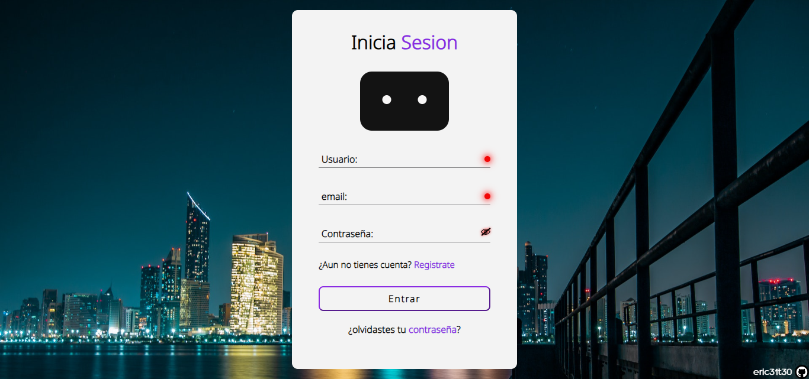

# Este proyecto es un formulario interactivo desarrollado con HTML, CSS y JavaScript.

-Interfaz de usuario intuitiva, creativa y fácil de usar.

-Validación de campos en tiempo real para garantizar la entrada de datos correcta.

Puede ver la demostracion con github-pages.

	

